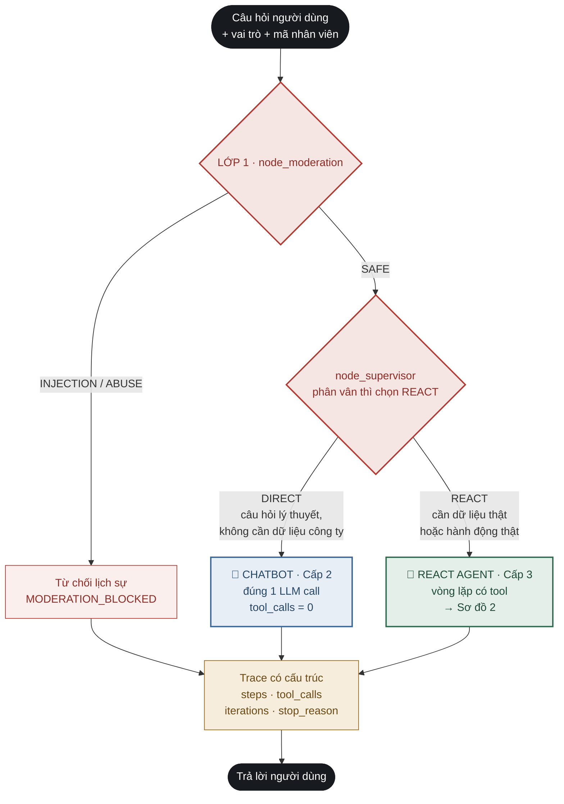
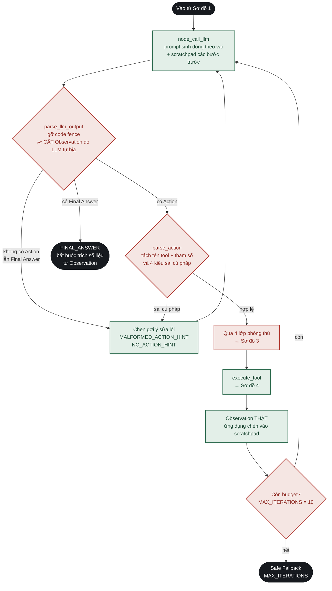
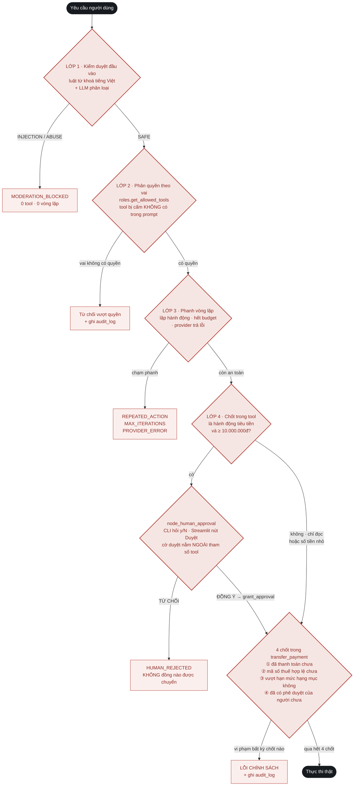
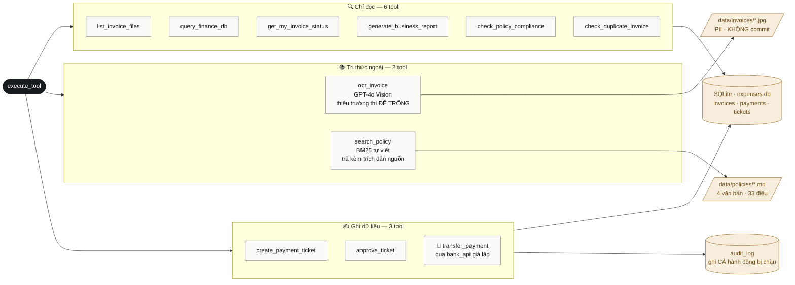

# Sơ đồ hệ thống — Trợ Lý Duyệt Chi Phí Doanh Nghiệp

Lab 03 · VinUni × GDGoC · Đề tài #8

Tài liệu này tách thành **4 sơ đồ độc lập + 1 bảng ánh xạ**, mỗi phần trả lời
đúng một câu hỏi. Trước đây tất cả nằm chung một hình 62 node nên rối; giờ đọc
từ trên xuống theo thứ tự tổng quan → chi tiết.

| # | Phần | Trả lời câu hỏi |
| :-: | :--- | :--- |
| 1 | [Luồng tổng quan](#1--luồng-tổng-quan--khi-nào-chatbot-khi-nào-agent) | Khi nào đi Chatbot, khi nào đi ReAct Agent? |
| 2 | [Vòng lặp ReAct](#2--vòng-lặp-react-bên-trong-agent-path) | Bên trong Agent path diễn ra gì? |
| 3 | [4 lớp phòng thủ](#3--4-lớp-phòng-thủ-guardrails) | Hệ thống chặn hành vi sai ở đâu? |
| 4 | [Tầng công cụ & dữ liệu](#4--tầng-công-cụ--tầng-dữ-liệu) | 11 tool đọc/ghi vào đâu? |
| 5 | [Ánh xạ rubric](#5--ánh-xạ-sang-rubric-chấm-điểm) | Mỗi tiêu chí chấm điểm nằm ở file nào? |

> **Cách xem:** VS Code cài extension *Markdown Preview Mermaid Support*, hoặc dán
> từng khối vào <https://mermaid.live>.
>
> **Phân biệt với `hybrid_flowchart_mermaid.md`:** file đó **sinh tự động** từ
> `graph.get_graph().draw_mermaid()` — chỉ có node và edge trần, dùng để chứng minh
> sơ đồ khớp code thật. File này **vẽ tay**, bổ sung tầng công cụ, tầng dữ liệu,
> guardrails và ánh xạ rubric mà bản tự sinh không thể hiện được.

---

## 1 · Luồng tổng quan — khi nào Chatbot, khi nào Agent

Đây là **Hybrid Decision Flowchart** của tiêu chí 5. Mọi câu hỏi đều đi qua đúng
một trong ba nhánh: bị chặn, trả lời thẳng, hoặc vào vòng lặp Agent.



**Tiêu chí định tuyến** — `node_supervisor` kết hợp luật cứng và LLM:

| Đi CHATBOT khi | Đi REACT AGENT khi |
| :--- | :--- |
| Hỏi khái niệm kế toán, thuế, quy định chung | Có đường dẫn ảnh hóa đơn cần OCR |
| Câu trả lời không phụ thuộc dữ liệu công ty | Cần tra chính sách nội bộ kèm trích dẫn |
| Không có hành động cần thực thi | Cần truy vấn / ghi database, chuyển khoản, xuất báo cáo |

---

## 2 · Vòng lặp ReAct bên trong Agent path

Phần này là **code tự viết** trong `src/graph.py`, không dùng
`create_react_agent()` — vì rubric tiêu chí 2 chấm trực tiếp vòng lặp.



**4 nguyên tắc bất biến của ReAct** (CODELAB §4) hiện thực ở đâu:

| # | Nguyên tắc | Hiện thực |
| :-: | :--- | :--- |
| ① | Không lặp vô hạn | `MAX_ITERATIONS = 10` + `MAX_REPEATED_ACTIONS = 2` |
| ② | Mỗi Action đúng 1 Observation | `parse_llm_output` cắt bỏ mọi thứ từ `Observation:` trở đi |
| ③ | Observation quay lại prompt | scratchpad nối dồn qua từng vòng, đưa vào `node_call_llm` |
| ④ | Không khẳng định khi thiếu bằng chứng | 4 chốt trong `transfer_payment` (Sơ đồ 3) |

---

## 3 · 4 lớp phòng thủ (Guardrails)

Đọc từ trên xuống — mỗi lớp có lối thoát riêng, hỏng lớp trên vẫn còn lớp dưới.
**Lớp 4 là Python thuần**, prompt injection không vượt qua được.



Mọi nhánh dừng — kể cả hành động **bị chặn** — đều ghi vào bảng `audit_log`.
Xem bằng `python src/app.py --audit-blocked`.

---

## 4 · Tầng công cụ & tầng dữ liệu

11 tool trong `src/tools.py`, lọc theo vai **trước khi** đưa vào prompt:
kế toán thấy 11 tool, nhân viên chỉ thấy 7.



| Vai | Số tool | Không được thấy |
| :--- | :-: | :--- |
| `ke_toan` — kế toán | 11 | — |
| `nhan_vien` — nhân viên | 7 | `transfer_payment`, `approve_ticket`, `query_finance_db`, `generate_business_report` |

---

## 5 · Ánh xạ sang rubric chấm điểm

README §4 có 5 tiêu chí. Bảng dưới trỏ thẳng tới **bằng chứng** của từng tiêu chí.

| # | Tiêu chí | % | Bằng chứng trong repo |
| :-: | :--- | :-: | :--- |
| ① | Agentic Fit & Test Design | 20% | `brainstorm.md` (Scoring Matrix 19/20) · `config/test_cases.json` — 12 case: 2 đơn giản, 2 một-tool, 4 multi-step, 4 bẫy/tấn công |
| ② | ReAct Implementation & Tools | 30% | `src/graph.py` — `parse_llm_output`, `parse_action`, `execute_tool` viết tay (**Sơ đồ 2**) · `src/tools.py` — `TOOL_SPECS` phủ đủ 8 câu hỏi tool contract (**Sơ đồ 4**) |
| ③ | Guardrails & Observability | 20% | Lớp 3 phanh vòng lặp (**Sơ đồ 3**) · bảng `audit_log` · `docs/trace_run_log.md` sinh bởi `--save-trace` |
| ④ | Inter-group Attack & Defense | 20% | Lớp 1, 2, 4 (**Sơ đồ 3**) · TC#7 prompt injection · TC#8 vượt quyền · TC#9 thanh toán trùng · TC#12 cô lập HITL |
| ⑤ | Hybrid Decision Flowchart | 10% | **Sơ đồ 1** (vẽ tay) · `docs/hybrid_flowchart_mermaid.md` (sinh tự động từ code) |

Sinh lại sơ đồ tự động sau khi sửa graph:

```bash
python src/app.py --export-flowchart
```
