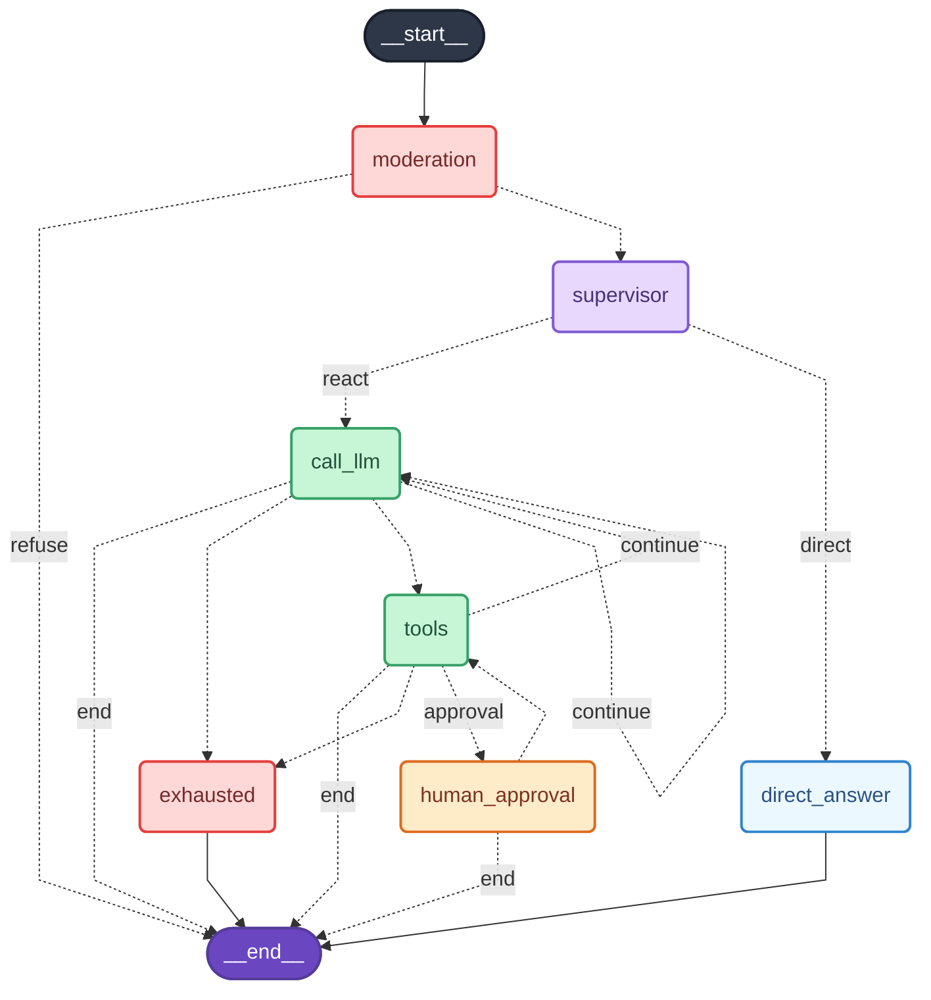

```mermaid
%%{init: {'flowchart': {'curve': 'linear'}}}%%
graph TD
    __start__(["__start__"]):::startNode
    moderation("moderation"):::guardNode
    supervisor("supervisor"):::routerNode
    direct_answer("direct_answer"):::chatbotNode
    call_llm("call_llm"):::reactNode
    tools("tools"):::reactNode
    human_approval("human_approval"):::approvalNode
    exhausted("exhausted"):::guardNode
    __end__(["__end__"]):::endNode

    __start__ --> moderation
    call_llm -. "end" .-> __end__
    call_llm -.-> exhausted
    call_llm -.-> tools
    human_approval -. "end" .-> __end__
    human_approval -.-> tools
    moderation -. "refuse" .-> __end__
    moderation -.-> supervisor
    supervisor -. "react" .-> call_llm
    supervisor -. "direct" .-> direct_answer
    tools -. "end" .-> __end__
    tools -. "continue" .-> call_llm
    tools -.-> exhausted
    tools -. "approval" .-> human_approval
    direct_answer --> __end__
    exhausted --> __end__
    call_llm -. "continue" .-> call_llm

    %% TÙY CHỈNH BẢNG MÀU PHÂN LOẠI CHỨC NĂNG
    classDef startNode fill:#2d3748,stroke:#1a202c,color:#fff,stroke-width:2px
    classDef endNode fill:#6b46c1,stroke:#553c9a,color:#fff,stroke-width:2px
    classDef guardNode fill:#fed7d7,stroke:#e53e3e,color:#742a2a,stroke-width:2px
    classDef routerNode fill:#e9d8fd,stroke:#805ad5,color:#44337a,stroke-width:2px
    classDef chatbotNode fill:#ebf8ff,stroke:#3182ce,color:#2c5282,stroke-width:2px
    classDef reactNode fill:#c6f6d5,stroke:#38a169,color:#22543d,stroke-width:2px
    classDef approvalNode fill:#feebc8,stroke:#dd6b20,color:#7b341e,stroke-width:2px
```